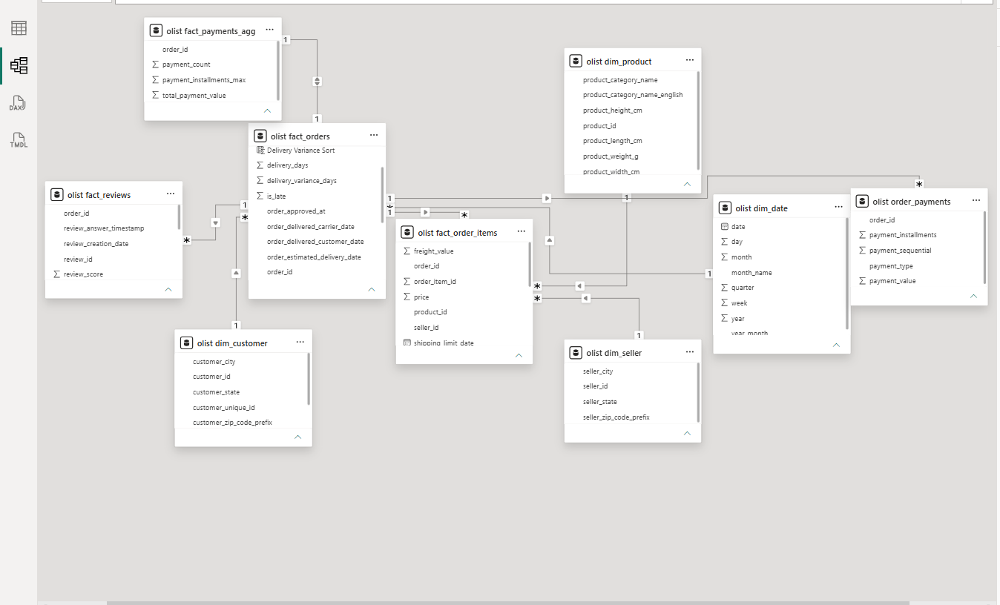

# Комплексный анализ e-commerce данных Olist
Аналитический проект: от аудита исходных данных и построения SQL-витрин до модели данных, BI-дашборда и бизнес-выводов.

## Бизнес-вопросы

В рамках анализа рассматривались следующие вопросы:

- Как менялись продажи и ключевые коммерческие показатели во времени?
- Какие регионы и товарные категории формируют основную часть оборота?
- Какова структура клиентской базы и насколько выражены повторные покупки?
- Насколько быстро и своевременно выполняются заказы?
- В каких регионах наблюдаются повышенная стоимость доставки и доля задержек?
- Насколько точно обещанная дата доставки соответствует фактической?
- Как задержки доставки связаны с оценками покупателей?
- Какие товарные категории характеризуются повышенной долей негативных отзывов?

## Данные

Исходный набор состоит из нескольких связанных таблиц с различной гранулярностью:

| Таблица | Содержание | Гранулярность |
|---|---|---|
| orders | Заказы и этапы доставки | 1 строка = 1 заказ |
| order_items | Товарные позиции заказа | 1 строка = 1 позиция заказа |
| order_payments | Платежи | 1 строка = 1 платежная запись |
| order_reviews | Отзывы покупателей | 1 строка = 1 отзыв |
| customers | Покупатели | 1 строка = customer_id |
| products | Товары и категории | 1 строка = 1 товар |
| sellers | Продавцы | 1 строка = 1 продавец |
| geolocation | Географические данные | несколько строк на индекс |
| product_category_name_translation | Перевод категорий | 1 строка = 1 категория |

Различие в гранулярности таблиц учитывалось при построении SQL-витрин и модели данных, чтобы избежать искажения агрегированных показателей.

## Аудит качества данных

Перед построением аналитической модели был проведён аудит структуры, гранулярности и связей исходных таблиц.

Основные проверки:

- `orders` содержит 99 441 заказ с уникальным `order_id`.
- `order_items` имеет гранулярность товарной позиции: один заказ может содержать несколько строк.
- `order_payments` содержит 103 886 записей для 99 440 заказов: один заказ может иметь несколько платежных записей.
- Прямое соединение `order_items` и `order_payments` по `order_id` создаёт риск размножения строк и искажения финансовых показателей.
- В таблице товаров выявлены отсутствующие и непереведённые категории; для аналитической модели они были обработаны отдельно.
- Проведена проверка ссылочной целостности между заказами и основными справочниками.
- Выполнена финансовая сверка стоимости товаров и доставки с платежными данными.

Особое внимание уделялось гранулярности данных: агрегирование выполнялось только после определения уровня каждой таблицы, чтобы избежать двойного учёта показателей.

## Подготовка аналитического слоя в SQL

После аудита исходных таблиц был подготовлен аналитический слой для дальнейшего использования в Power BI.

Основные объекты:

- `fact_orders` — заказы, статусы, даты и показатели выполнения доставки;
- `fact_order_items` — товарные позиции, стоимость товаров и доставки;
- `fact_payments_agg` — платежи, предварительно агрегированные до уровня заказа;
- `fact_reviews` — отзывы и оценки покупателей;
- `dim_customer` — покупатели и география;
- `dim_product` — товары и категории;
- `dim_seller` — продавцы;
- `dim_date` — календарное измерение для временного анализа.

Предварительное агрегирование платежей до уровня заказа позволило исключить fan-out при соединении платежей с товарными позициями.

SQL-скрипты проекта:

- [`01_data_quality.sql`](sql/01_data_quality.sql) — проверки качества исходных данных;
- [`02_products_quality.sql`](sql/02_products_quality.sql) — анализ качества товарного справочника;
- [`03_grain_audit.sql`](sql/03_grain_audit.sql) — проверка гранулярности и рисков соединений;
- [`04_fact_views.sql`](sql/04_fact_views.sql) — создание таблиц фактов;
- [`05_dimensions.sql`](sql/05_dimensions.sql) — подготовка измерений.

## Модель данных

Для аналитики в Power BI построена модель на основе таблиц фактов и измерений.

Основные связи построены по идентификаторам заказов, клиентов, товаров, продавцов и календарной дате. Направления фильтрации настроены таким образом, чтобы аналитические показатели корректно пересчитывались при использовании срезов и разрезов отчёта.

