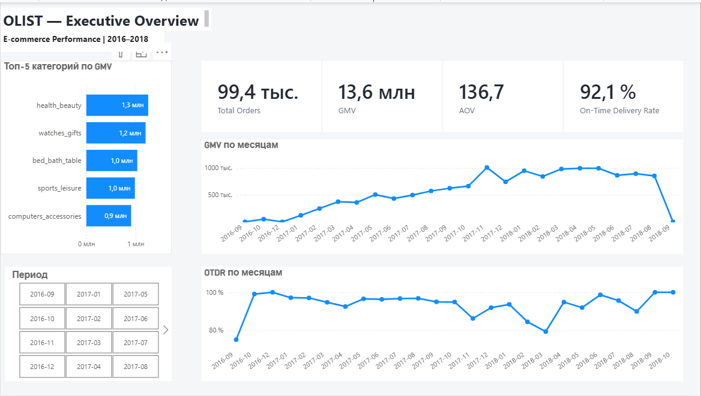
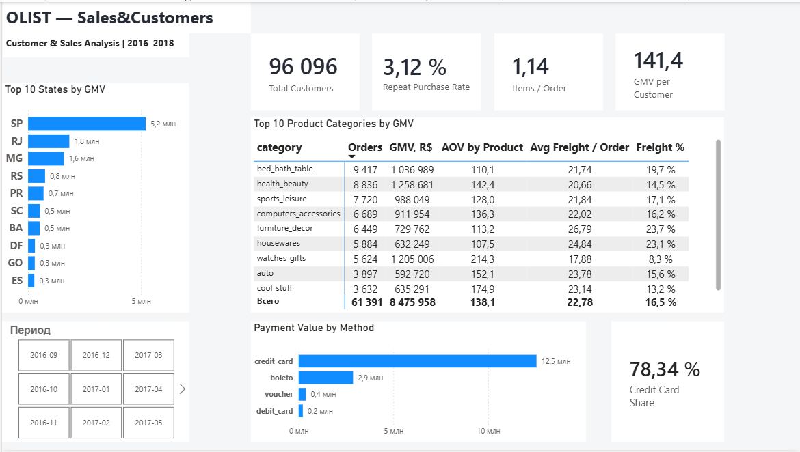
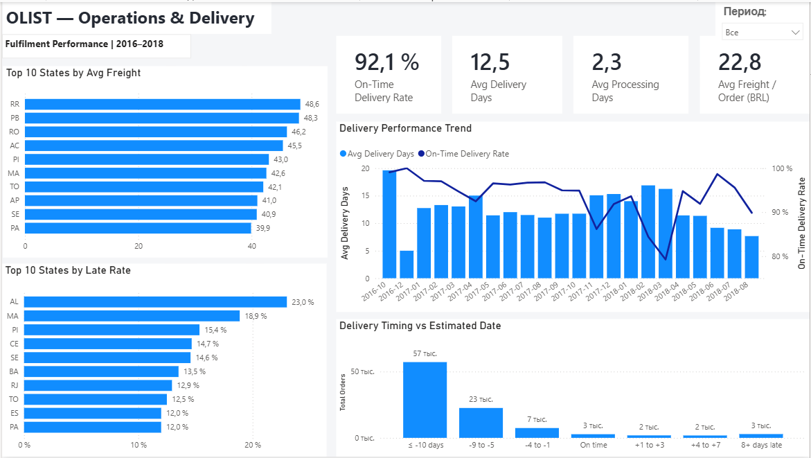
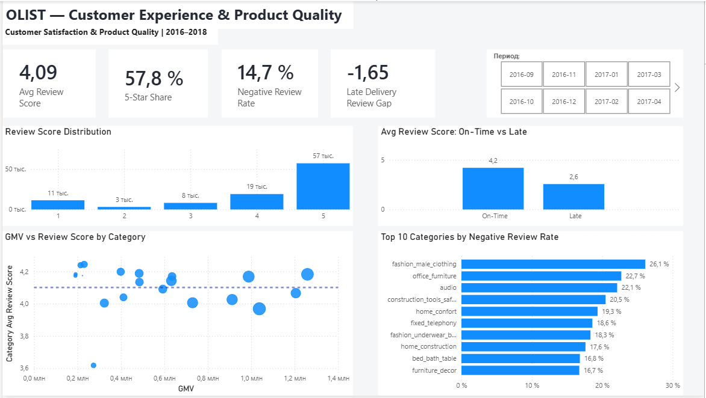

# Комплексный анализ e-commerce данных Olist
Аналитический проект: от аудита исходных данных и построения SQL-витрин до модели данных, BI-дашборда и бизнес-выводов.

## Бизнес-вопросы

В рамках анализа рассматривались следующие вопросы:

- Как менялись продажи и ключевые коммерческие показатели во времени?
- Какие регионы и товарные категории формируют основную часть оборота?
- Какова структура клиентской базы и насколько выражены повторные покупки?
- Насколько быстро и своевременно выполняются заказы?
- В каких регионах наблюдаются повышенная стоимость доставки и доля задержек?
- Насколько точно обещанная дата доставки соответствует фактической?
- Как задержки доставки связаны с оценками покупателей?
- Какие товарные категории характеризуются повышенной долей негативных отзывов?

## Данные

Исходный набор состоит из нескольких связанных таблиц с различной гранулярностью:

| Таблица | Содержание | Гранулярность |
|---|---|---|
| orders | Заказы и этапы доставки | 1 строка = 1 заказ |
| order_items | Товарные позиции заказа | 1 строка = 1 позиция заказа |
| order_payments | Платежи | 1 строка = 1 платежная запись |
| order_reviews | Отзывы покупателей | 1 строка = 1 отзыв |
| customers | Покупатели | 1 строка = customer_id |
| products | Товары и категории | 1 строка = 1 товар |
| sellers | Продавцы | 1 строка = 1 продавец |
| geolocation | Географические данные | несколько строк на индекс |
| product_category_name_translation | Перевод категорий | 1 строка = 1 категория |

Различие в гранулярности таблиц учитывалось при построении SQL-витрин и модели данных, чтобы избежать искажения агрегированных показателей.

## Аудит качества данных

Перед построением аналитической модели был проведён аудит структуры, гранулярности и связей исходных таблиц.

Основные проверки:

- `orders` содержит 99 441 заказ с уникальным `order_id`.
- `order_items` имеет гранулярность товарной позиции: один заказ может содержать несколько строк.
- `order_payments` содержит 103 886 записей для 99 440 заказов: один заказ может иметь несколько платежных записей.
- Прямое соединение `order_items` и `order_payments` по `order_id` создаёт риск размножения строк и искажения финансовых показателей.
- В таблице товаров выявлены отсутствующие и непереведённые категории; для аналитической модели они были обработаны отдельно.
- Проведена проверка ссылочной целостности между заказами и основными справочниками.
- Выполнена финансовая сверка стоимости товаров и доставки с платежными данными.

Особое внимание уделялось гранулярности данных: агрегирование выполнялось только после определения уровня каждой таблицы, чтобы избежать двойного учёта показателей.

## Подготовка аналитического слоя в SQL

После аудита исходных таблиц был подготовлен аналитический слой для дальнейшего использования в Power BI.

Основные объекты:

- `fact_orders` — заказы, статусы, даты и показатели выполнения доставки;
- `fact_order_items` — товарные позиции, стоимость товаров и доставки;
- `fact_payments_agg` — платежи, предварительно агрегированные до уровня заказа;
- `fact_reviews` — отзывы и оценки покупателей;
- `dim_customer` — покупатели и география;
- `dim_product` — товары и категории;
- `dim_seller` — продавцы;
- `dim_date` — календарное измерение для временного анализа.

Предварительное агрегирование платежей до уровня заказа позволило исключить fan-out при соединении платежей с товарными позициями.

SQL-скрипты проекта:

- [`01_data_quality.sql`](sql/01_data_quality.sql) — проверки качества исходных данных;
- [`02_products_quality.sql`](sql/02_products_quality.sql) — анализ качества товарного справочника;
- [`03_grain_audit.sql`](sql/03_grain_audit.sql) — проверка гранулярности и рисков соединений;
- [`04_fact_views.sql`](sql/04_fact_views.sql) — создание таблиц фактов;
- [`05_dimensions.sql`](sql/05_dimensions.sql) — подготовка измерений.

## Модель данных

Для аналитики в Power BI построена модель на основе таблиц фактов и измерений.

Основные связи построены по идентификаторам заказов, клиентов, товаров, продавцов и календарной дате. Направления фильтрации настроены таким образом, чтобы аналитические показатели корректно пересчитывались при использовании срезов и разрезов отчёта.

## BI-дашборд

В Power BI построены четыре аналитические страницы, каждая из которых отвечает на отдельный блок бизнес-вопросов.

### 1. Executive Overview (сводный управленческий обзор)

Сводный управленческий обзор ключевых показателей: GMV (валовой объём продаж), количество заказов, AOV (средний чек), своевременность доставки, динамика продаж и ведущие товарные категории.

### 2. Sales & Customers (продажи и клиенты)

Анализ структуры продаж и клиентской базы: география оборота, товарные категории, повторные покупки, количество товаров в заказе и структура платежей.

### 3. Operations & Delivery (операции и доставка)

Анализ операционной эффективности доставки: сроки обработки и доставки заказов, доля задержек, стоимость доставки по регионам и отклонение фактической даты от обещанной.

### 4. Customer Experience & Product Quality (клиентский опыт и качество товарных категорий)

Анализ клиентского опыта: распределение оценок, доля негативных отзывов, связь задержек доставки с рейтингом и выявление категорий с повышенным уровнем негатива.

## Ключевые выводы

### Продажи и общая динамика бизнеса

- За рассматриваемый период было оформлено около **99,4 тыс. заказов** с GMV (валовым объёмом продаж) около **13,6 млн R$** и AOV (средним чеком) **136,7 R$**.

- Динамика GMV (валового объёма продаж) показывает выраженный рост бизнеса на основной части анализируемого периода. При интерпретации крайних месяцев необходимо учитывать неполноту данных.

- Продажи заметно концентрируются в отдельных товарных категориях: крупнейший вклад в GMV (валовой объём продаж) формируют `health_beauty`, `watches_gifts`, `bed_bath_table`, `sports_leisure` и `computers_accessories`.

### Клиенты и структура продаж

- В данных представлено около **96,1 тыс. уникальных покупателей**, при этом Repeat Purchase Rate (доля клиентов с повторными покупками) составляет только **3,12%**. Клиентская база преимущественно состоит из разовых покупателей.

- Среднее количество товаров в заказе составляет **1,14**, что также указывает на преобладание небольших корзин.

- Продажи географически распределены неравномерно: штат `SP` формирует значительно больший GMV (валовой объём продаж), чем остальные регионы, за ним следуют `RJ` и `MG`.

- Оплата банковской картой является основным способом платежа и формирует около **78,3% стоимости платежей**.

### Операции и доставка

- OTDR (доля заказов, доставленных не позднее обещанной даты) составляет около **92,1%**, однако средний показатель скрывает заметные региональные различия. Например, Late Rate (доля задержанных заказов) достигает примерно **23% в AL** и **18,9% в MA**.

- Средний срок доставки составляет около **12,5 дня**, тогда как среднее время внутренней обработки заказа до передачи перевозчику — около **2,3 дня**. Основная часть общего срока выполнения заказа формируется после внутренней обработки.

- Более **80% проанализированных доставок** поступили минимум на 5 дней раньше обещанной даты. Распределение указывает на существенный запас в ETA (расчётной дате доставки) и возможность дополнительного анализа точности обещанных сроков.

- Регионы с наиболее высокой средней стоимостью доставки не полностью совпадают с регионами с максимальной долей задержек. Стоимость логистики и качество сервиса следует анализировать отдельно.

### Клиентский опыт и качество товарных категорий

- Средний Review Score (рейтинг отзыва) составляет **4,09 из 5**, при этом **57,8% отзывов имеют оценку 5**, а доля негативных отзывов с оценкой 1–2 составляет **14,7%**.

- Заказы, доставленные вовремя, имеют средний Review Score (рейтинг отзыва) около **4,2**, тогда как задержанные — около **2,6**. Разница составляет примерно **1,65 балла**, что показывает сильную связь между соблюдением срока доставки и клиентской оценкой.

- Уровень негативных отзывов существенно различается между товарными категориями: среди категорий с достаточным количеством отзывов максимальная доля негатива превышает **26%**.

- Анализ GMV (валового объёма продаж) и Review Score (рейтинга отзывов) показывает наличие коммерчески значимых категорий с оценкой ниже среднего уровня. Такие категории являются приоритетными кандидатами для дальнейшего анализа причин клиентского недовольства.

- Repeat Purchase Rate (доля повторных покупок) составляет около **3,1%**, что указывает на низкую повторяемость заказов в рассматриваемом наборе данных.

- На уровне товарных категорий присутствуют коммерчески значимые направления с Customer Review Score (оценкой клиентов) ниже среднего, которые требуют отдельного анализа причин негативного опыта.
